# Multi-Month Mini Calendar

**See as many months as you want, laid out however you like — in an app so light you'll forget it's running.**
A tiny, blazing-fast, **read-only** calendar that lives in your macOS menu bar. No schedule management, no clutter — just dates.


## ⬇️ Install (Download)


1. 📦 Download `Multi-Month-Mini-Calendar.zip` from the [latest release](https://github.com/kujiy/multi-month-mini-calendar/releases/latest).
2. 🗂️ Unzip it and move **Multi-Month Mini Calendar.app** to `/Applications`.
3. 🔓 The app is ad-hoc signed (not notarized), so macOS Gatekeeper blocks it on first launch. Open it once with either method:
   - 🖱️ **Right-click the app → Open → Open**, or
   - ⌨️ run this in Terminal to clear the quarantine flag:
     ```bash
     xattr -dr com.apple.quarantine "/Applications/Multi-Month Mini Calendar.app"
     ```

✅ After the first launch it opens normally by double-clicking.

## 🍺 Install (Homebrew)

```bash
brew install --cask kujiy/tap/multi-month-mini-calendar
```

The app is ad-hoc signed (not notarized), so on first launch macOS Gatekeeper may block it.
If so, clear the quarantine flag once:

```bash
xattr -dr com.apple.quarantine "/Applications/Multi-Month Mini Calendar.app"
```
<hr />

<table align="center">
  <tr>
    <td align="center" valign="top">
      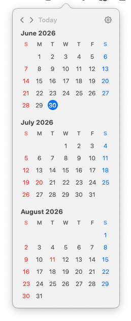<br>
      <sub><strong>3 months · Vertical</strong></sub>
    </td>
    <td align="center" valign="top">
      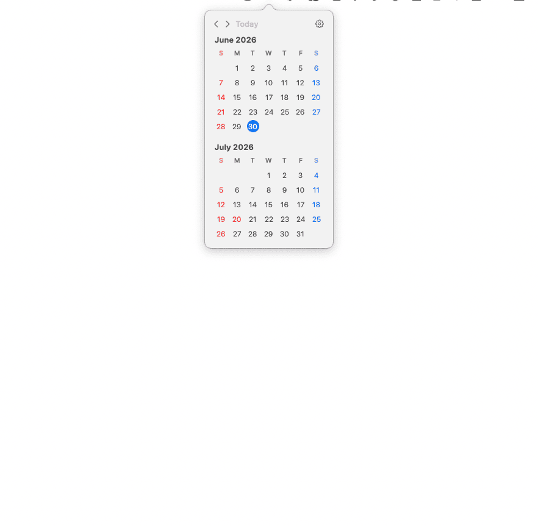<br>
      <sub><strong>2 months · Vertical</strong></sub>
    </td>
    <td align="center" valign="top">
      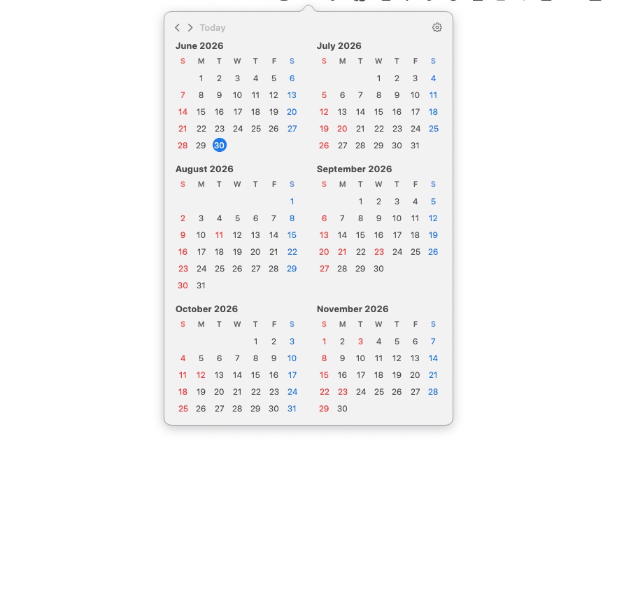<br>
      <sub><strong>6 months · Grid (2 col)</strong></sub>
    </td>
    <td align="center" valign="top">
      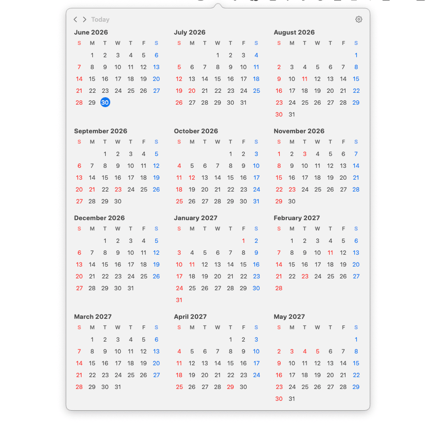<br>
      <sub><strong>12 months · Grid (3 col)</strong></sub>
    </td>
  </tr>
</table>

<table align="center">
  <tr>
    <td align="center" valign="top">
      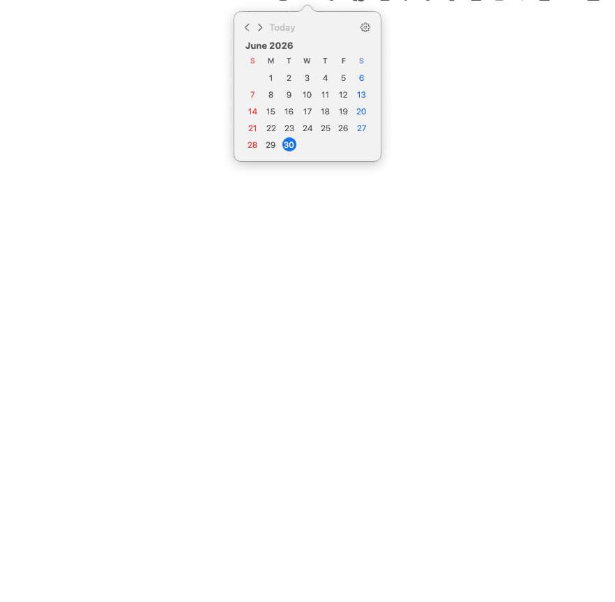<br>
      <sub><strong>1 month</strong></sub>
    </td>
    <td align="center" valign="top">
      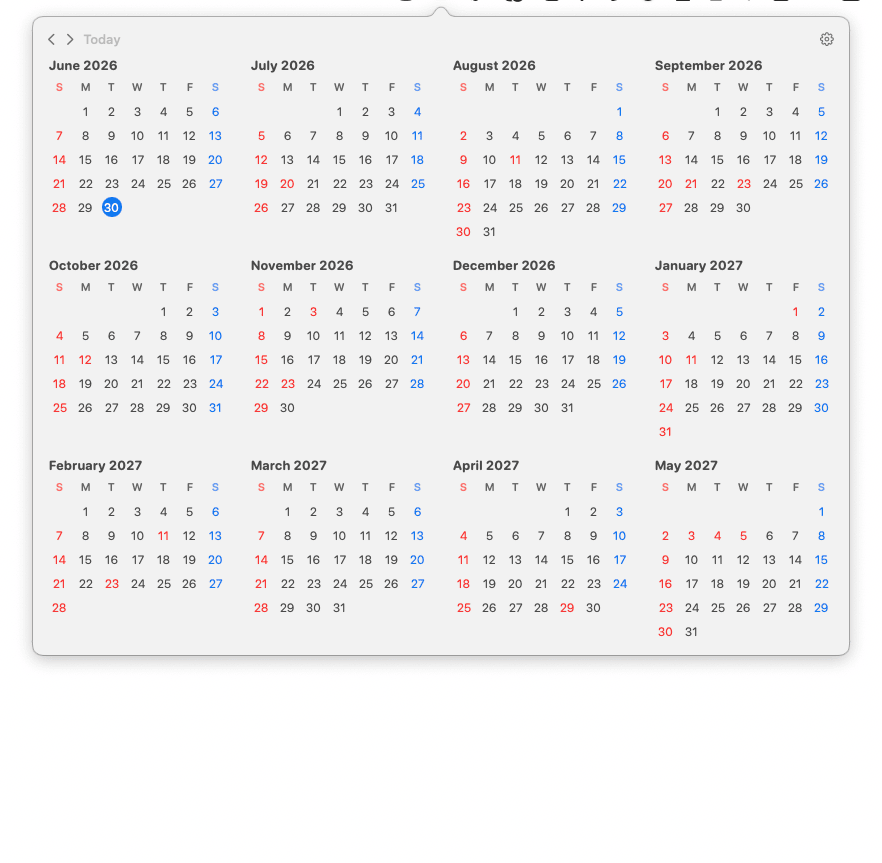<br>
      <sub><strong>12 months · Grid (4 col)</strong></sub>
    </td>
    <td align="center" valign="top">
      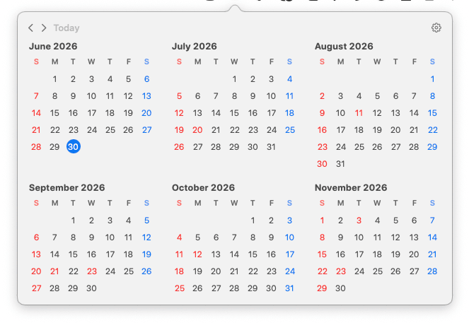<br>
      <sub><strong>6 months · Grid (3 col)</strong></sub>
    </td>
  </tr>
</table>

<table align="center">
  <tr>
    <td align="center" valign="top">
      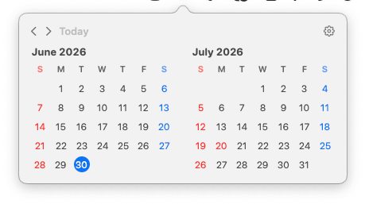<br>
      <sub><strong>2 months · Horizontal</strong></sub>
    </td>
    <td align="center" valign="top">
      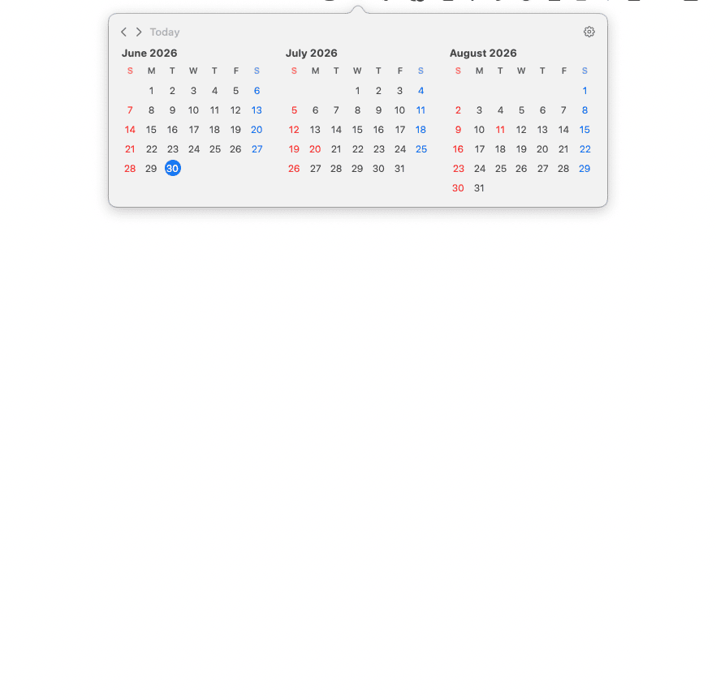<br>
      <sub><strong>3 months · Horizontal</strong></sub>
    </td>
  </tr>
</table>

<p align="center"><em>Nine ready-made layouts — pick the one that fits your screen and your week. 🗓</em></p>

<h3 align="center">👀 …and peek at last month, too</h3>

<p align="center"><strong>Last Month</strong> mode starts the view one month early, so the month you just wrapped up stays in sight right above today — perfect for a quick look back.</p>

<table align="center">
  <tr>
    <td align="center" valign="top">
      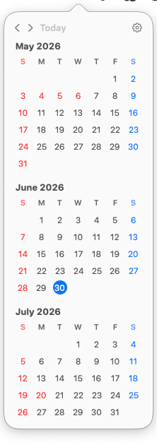<br>
      <sub><strong>3 months · Vertical</strong></sub>
    </td>
    <td align="center" valign="top">
      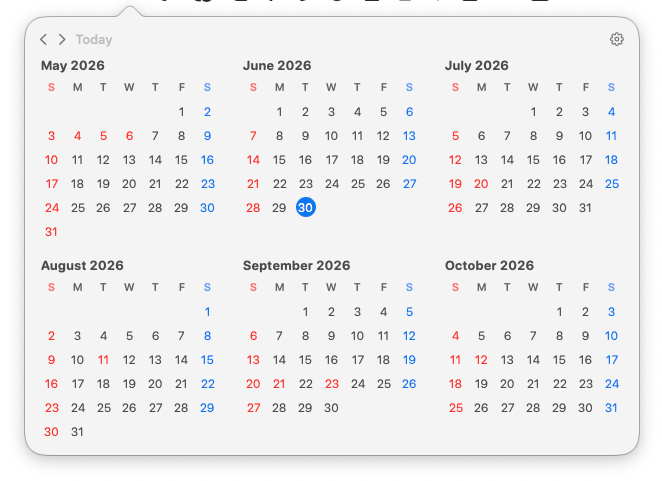<br>
      <sub><strong>6 months · Grid (3 col)</strong></sub>
    </td>
    <td align="center" valign="top">
      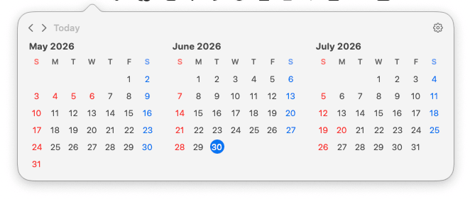<br>
      <sub><strong>3 months · Horizontal</strong></sub>
    </td>
  </tr>
</table>

<h3 align="center">🩶 Fill the blanks — <em>Show Adjacent Month Days</em></h3>

<p align="center">Flip one toggle to fill the empty cells before the 1st and after the last day with the neighboring month's dates in a faint gray — so every week row stays complete. Or turn it off for a clean, uncluttered grid.</p>

<table align="center">
  <tr>
    <td align="center" valign="top">
      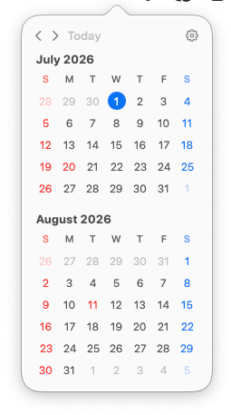<br>
      <sub><strong>On</strong> · blanks filled faintly</sub>
    </td>
    <td align="center" valign="top">
      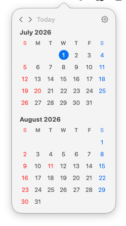<br>
      <sub><strong>Off</strong> · clean blanks</sub>
    </td>
  </tr>
</table>

<hr />

## Why you'll like it

- 📆 **See multiple months at once** — 1, 2, 3, 6, or 12 months in a single click. Plan a quarter or eyeball the whole year without scrolling.
- 🧩 **Flexible layouts** — vertical, horizontal, or grid (1–4 columns). The nine combinations above are all built in, so the calendar fits *your* screen instead of the other way around.
- 🪶 **Insanely lightweight** — no Dock icon, no network, no permission prompts, pure read-only. It sits quietly in the menu bar, opens instantly, and stays out of your way.

## Features

- 🗓 **Multi-month view** — show 1 / 2 / 3 / 6 / 12 months at once
- 🧩 **Flexible layouts** — Vertical / Horizontal / Grid (1–4 columns)
- 📍 **Starting month** — from the current month / Last Month (keeps today in view with one month of look-back) / from January every year (yearly calendar)
- ◀▶ **Month navigation** and **Today** to jump back to the current month
- 🔴 Sundays in red, 🔵 Saturdays in blue, today highlighted with the accent color
- 📅 Toggle between Monday / Sunday week start
- 🎌 **Holiday display** — automatically detects the target country from macOS region settings and shows holidays in red (offline, 150+ countries)
- 🩶 **Adjacent month days** — fill the blanks before the 1st and after the last day with the previous/next month's dates, shown faintly (toggle on/off)
- 🚫 No Dock icon, no network, no permission requests, read-only (clicking a date does nothing)

## Requirements

- macOS 15 or later (Apple Silicon / Intel)

## Build and Run

### Use as an app (recommended)

```bash
./build-app.sh
open "build/Multi-Month Mini Calendar.app"
```

A 📅 icon appears in the menu bar. Click it to open the calendar; click outside to close it.
Use the gear icon for settings and the power icon to quit.

### During development

```bash
swift build          # build
swift test           # unit tests (calendar calculation logic)
swift run            # launch directly (menu-bar resident)
```

## Settings

<p align="center">
  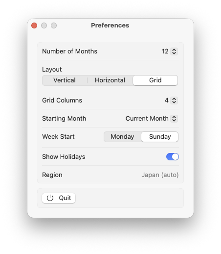
</p>

| Setting | Default | Options |
|---------|---------|---------|
| **Number of Months** | 3 | 1 / 2 / 3 / 6 / 12 |
| **Layout** | Vertical | Vertical / Horizontal / Grid |
| **Grid Columns** | 1 | 1–4 (only effective with Grid) |
| **Starting Month** | Last Month | Current Month / Last Month / January (disabled in 1-month view, which always starts at the current month) |
| **Week Start** | Sunday | Monday / Sunday |
| **Show Holidays** | On | On / Off |
| **Show Adjacent Month Days** | On | On / Off — fill the blanks before the 1st and after the last day with the previous/next month's dates, shown faintly |
| **Launch at Login** | Off | On / Off — automatically start the app when you log in to your Mac |

The target country for holidays is **automatically detected from the macOS "Language & Region" settings** (there is no manual selection).
The detected region is shown in the settings screen.

Settings are saved to `UserDefaults` and restored on the next launch. Launch at Login is managed by macOS (`SMAppService`) and can also be toggled from System Settings → General → Login Items.

## Structure

```
Sources/MultiMonthMiniCalendar/
  App.swift            # @main / NSStatusItem + NSPopover / hides the Dock icon
  HolidayProvider.swift# region auto-detection + offline loading of holiday data
  Preferences.swift    # settings model (UserDefaults persistence)
  CalendarMath.swift   # date calculations (pure logic, UI-independent)
  MonthView.swift      # rendering of a single month
  PopoverView.swift    # popover body (month navigation / layout)
  PreferencesView.swift# settings screen
  Holidays/<CC>.json   # bundled holiday data (per country, offline)
Tests/                 # unit tests for CalendarMath / HolidayProvider
Resources/Info.plist   # LSUIElement = true (menu-bar resident)
scripts/
  generate-holidays.swift  # holiday data generation tool (development only, requires network)
build-app.sh           # script to generate the .app bundle
```

The date calculation logic (`CalendarMath`) is a set of pure functions independent of the UI.
It receives the reference date and `Calendar` as arguments, so it can be tested deterministically.

## Holiday Data

Holiday data is sourced from **[Nager.Date](https://date.nager.at)**, and JSON built during development is
bundled into the app as `Sources/MultiMonthMiniCalendar/Holidays/<country code>.json`.
At runtime it uses no network and loads only the single auto-detected country offline.

- Coverage: years 2000–2050 / 150+ countries
- Includes **nationwide holidays only** (state/region-specific holidays are excluded)
- Nager.Date's code is MIT and its data is close to public domain, with no attribution display requirement

To update or extend the data (**network is used only during development, not at runtime**):

```bash
swift scripts/generate-holidays.swift   # regenerate Holidays/*.json
```

## License

The code for this app is [MIT License](LICENSE).
The holiday data is sourced from [Nager.Date](https://date.nager.at) (code MIT, data close to public domain with no attribution requirement).
